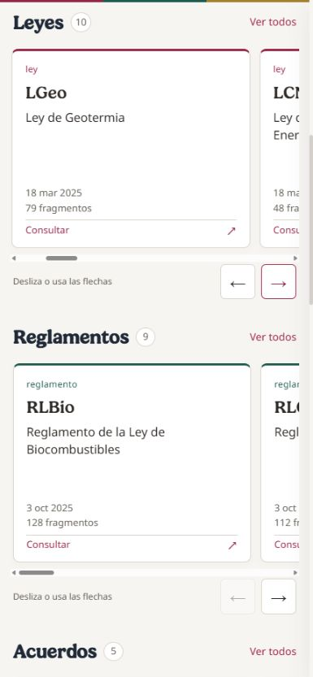
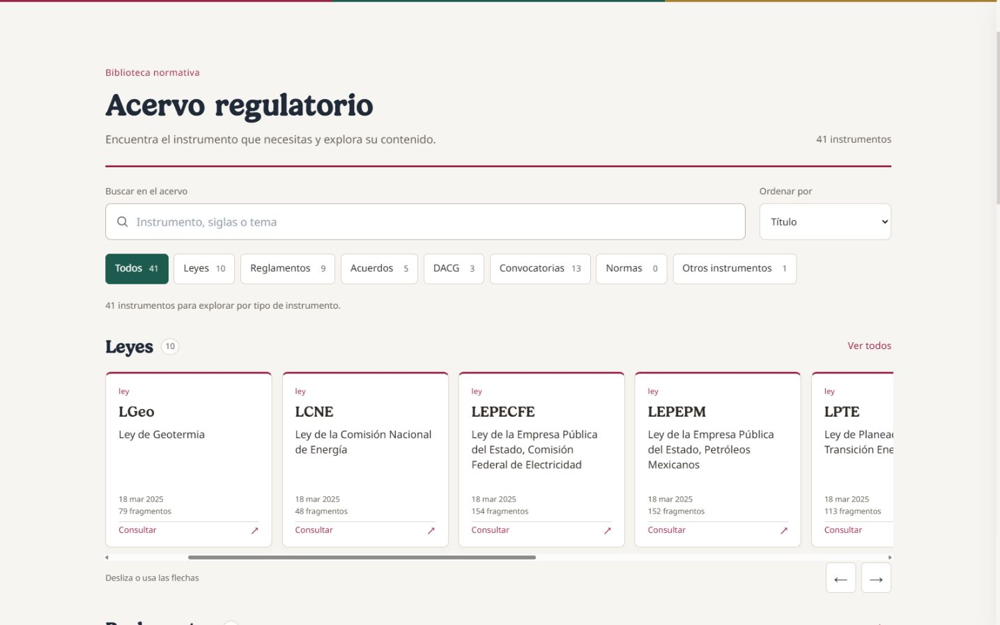

# Biblioteca del acervo

Entrega del 19 de septiembre de 2026. Sustituye la tabla continua por colecciones con tarjetas y desplazamiento horizontal: Leyes, Reglamentos, Acuerdos, DACG, Convocatorias, Normas y Otros instrumentos. Las colecciones vacías no generan filas; el filtro conserva su conteo cero.

La búsqueda del acervo consulta títulos, siglas y temas. «Ver todos» abre una colección en cuadrícula, de una columna en móvil; el buscador global de artículos sigue disponible desde Inicio. La ruta conserva búsqueda, grupo y orden. Al volver de un instrumento se recuperan foco, posición vertical y desplazamiento de las filas.

Los grupos son una ayuda de navegación, sin modificar el tipo jurídico en Supabase. Por ejemplo, un acuerdo que emite DACG se encuentra en DACG y mantiene «acuerdo» en su ficha. Las fechas corresponden a publicación y los conteos se denominan fragmentos.

La revisión del catálogo cargado mostró 41 instrumentos: 10 leyes, 9 reglamentos, 5 acuerdos, 3 DACG, 13 convocatorias y 1 en Otros. La interfaz calcula los números a partir de los datos; no están fijados en el código.

## Validación

- 136 pruebas de 17 archivos aprobadas, incluido retorno desde instrumento, rutas, títulos largos y búsquedas asíncronas que terminan después de cambiar de vista.
- ESLint y build de producción aprobados. Se conserva la advertencia previa por tamaño del bundle.
- Navegador: 320 y 390 píxeles CSS en móvil, 1440 en escritorio, sin desbordamiento horizontal de página. Carrusel, búsqueda LCNE, apertura y retorno comprobados.
- Modo oscuro: corregido el contraste de encabezados ante las reglas globales de tema. Controles del carrusel de aproximadamente 44 píxeles; no avanza automáticamente.

La mejora de estadísticas está descrita en [la propuesta](PROPUESTA-ESTADISTICAS.md); aún no está implementada. Esta entrega no amplía ni modifica la cobertura del lector sincronizado.
